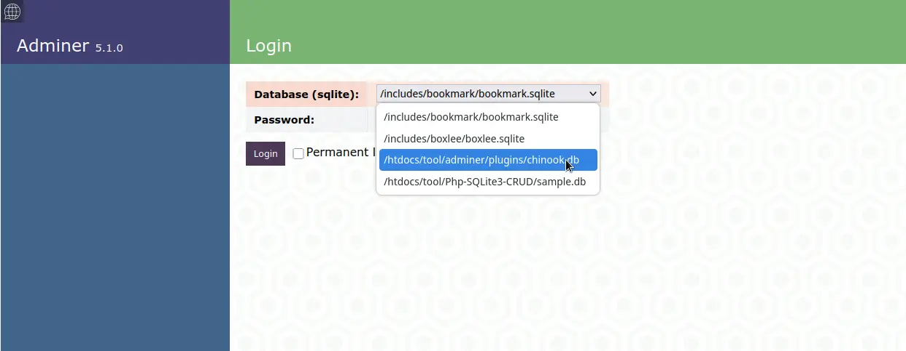
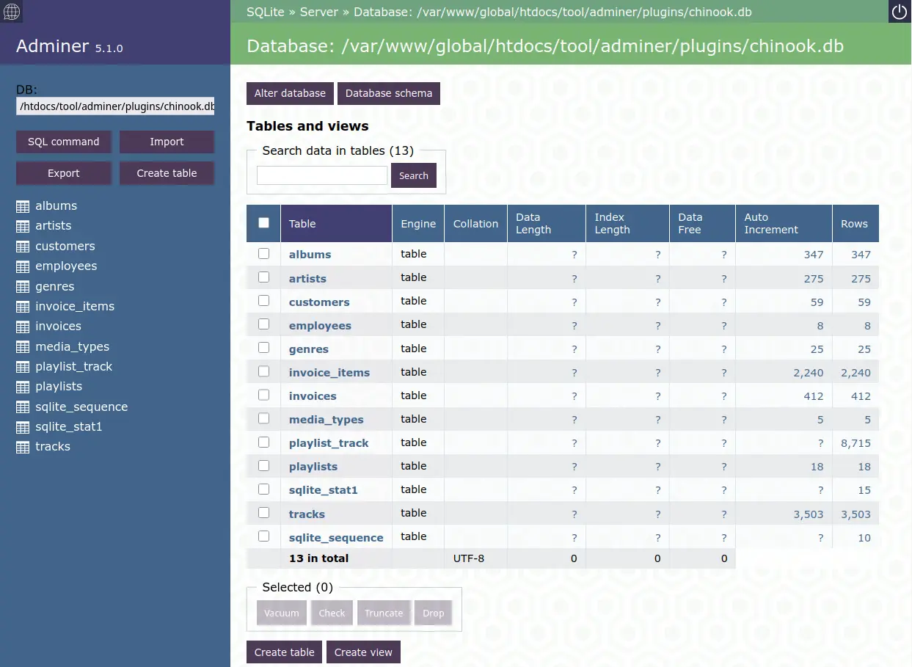

# Adminer SQLite Plugin

This plugin enhances **[Adminer](https://www.adminer.org/)** by simplifying the login process for SQLite databases. Instead of the standard login form, users only need to select a SQLite database and enter a password.

## Features

- **Simplified Login**: works out of the box, for demonstration, [adminer.php](https://github.com/vrana/adminer/releases/download/v5.1.0/adminer-5.1.0.php) (V 5.1.0) is included as well. Feel free to get the newest version.
- **Password Protection**: Stores the hashed password securely in `CSqlite.pwd`.
- **Automatic Database Detection**: Recursively scans a specified directory for `*.sqlite` or `*.db` files.
- **Easy Configuration**: comes with defaults that can easily be overwritten.
- **Sample Database**: Playground `chinook.db` is included, [sample db from sqlitetutorial.net](https://www.sqlitetutorial.net/sqlite-sample-database/)

## Installation

1. **Upload Adminer & Plugin**: Copy the files to your web server directory.
2. **Adjust Configuration**:
   - Default configuration can be adjusted in `sqlite.php`:
     ```php
      # overwrite defaults
      $aOpt = [
          # root path to search for files
          'vPath' => '/var/www/global',
          # we search for *.sqlite / *.db files
          'vSearch' => "#(.+\.sqlite|.+\.db)$#",
          # write access!
          'vPwdFile' => __DIR__ . "/CSqlite.pwd",
      ];
     ```
3. **Set File Permissions**:
   Ensure the web server has write access to file/directory of `vPwdFile` and databases:
   ```sh
   chmod 775 /var/www/global/htdocs/adminer/plugins
   chgrp www-data /var/www/global/htdocs/adminer/plugins
   …
   ```

## Password Management

- The default password in the sample file `CSqlite.pwd` is `12345678`.
- To change the password, delete `CSqlite.pwd` and log in with a new password.
- On first login, the entered password is encrypted and saved in `CSqlite.pwd`.

## Theme

- As an example, the design `lucas-sandery` is applied.
- Delete `adminer.css` to revert to the default design.
- Or use a different theme from [this list](https://www.adminer.org/).

## Usage

1. Open Adminer with the plugin in your browser: `https://[domain/path]/adminer/sqlite.php`

     
   *Figure 1: Adminer SQLite Plugin login page*  

2. Select a database from the list.

     
   *Figure 2: Database selection screen*  

3. Enter the password. The password will be saved on the first login after deleting `CSqlite.pwd`.

4. Login!

     
   *Figure 3: Successful login*  

## Note

- If no databases are found, check the path setting ($aOpt['vPath']) in `sqlite.php` and file permissions.
- A direct call to `https://[domain]/[path]/adminer/adminer.php` opens the unchanged Adminer version.
- You might want to set a symlink `index.php` to sqlite.php.

## License

MIT License

